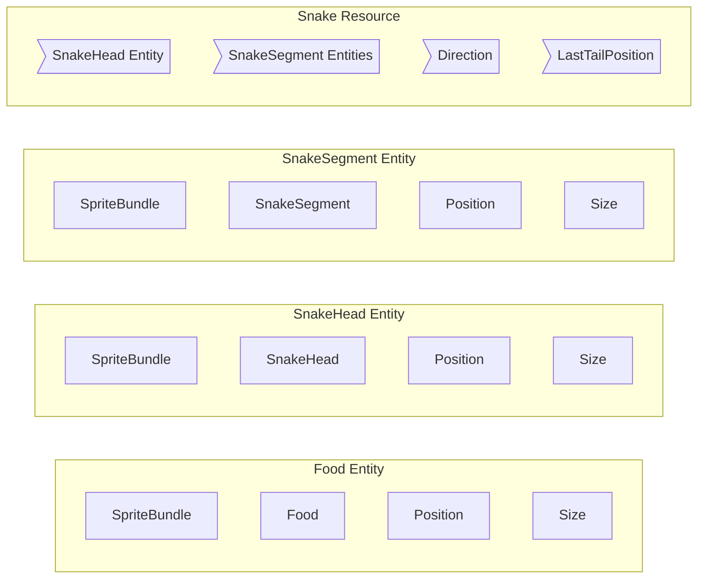
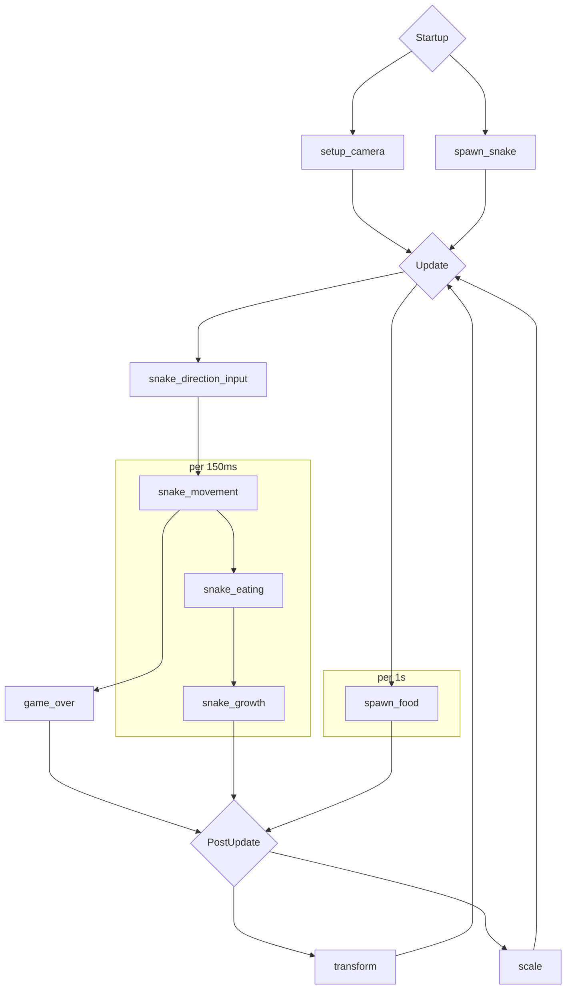

```mermaid
flowchart LR

subgraph Food Entity
A1[SpriteBundle]
A2[Food]
A3[Position]
A4[Size]
end

subgraph SnakeHead Entity
B1[SpriteBundle]
B2[SnakeHead]
B3[Position]
B4[Size]
end

subgraph SnakeSegment Entity
C1[SpriteBundle]
C2[SnakeSegment]
C3[Position]
C4[Size]
end

subgraph Snake Resource
D1>SnakeHead Entity]
D2>SnakeSegment Entities]
D3>Direction]
D4>LastTailPosition]
end
```

```mermaid
flowchart TD

A{Startup} ---> setup_camera ---> B{Update}
A ---> spawn_snake ---> B
B ---> snake_direction_input ---> snake_movement
subgraph per 150ms
snake_movement ---> snake_eating ---> snake_growth
end
snake_movement ---> game_over ---> C
snake_growth ---> C{PostUpdate}
subgraph per 1s
spawn_food
end
B ---> spawn_food ---> C
C ---> transform ---> B
C ---> scale ---> B
```