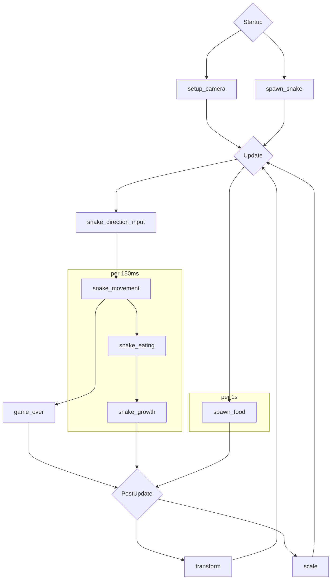

```mermaid
flowchart TD

A{Startup} ---> setup_camera ---> B{Update}
A ---> spawn_snake ---> B
B ---> snake_direction_input ---> snake_movement
subgraph per 150ms
snake_movement ---> snake_eating ---> snake_growth
end
snake_movement ---> game_over ---> C
snake_growth ---> C{PostUpdate}
subgraph per 1s
spawn_food
end
B ---> spawn_food ---> C
C ---> transform ---> B
C ---> scale ---> B
```